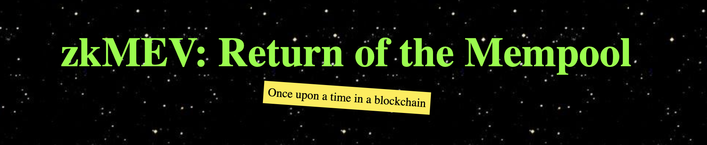
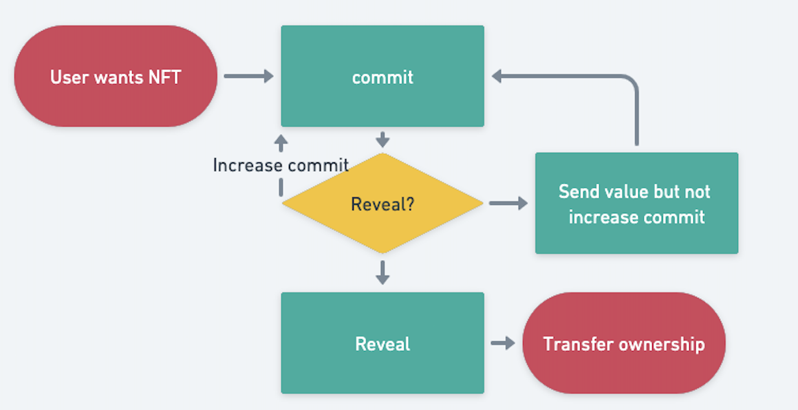

# zk-mev-ethnyc22

Welcome to zkMEV repository! Go [zkMEV](https://franz101.github.io/zk-mev-frontend/) Now! May the zkMEV be with you.

## Light side of the zkMEV
To prevent frontrunning, the zkMEV requires a commit/reveal process to buy NFT. Commit-Reveal smart contract is validated by customized OpenSea Seaport zone smart contract. The user must:
- Generate a commitment hash from the NFT what they want to buy and a secret value.
- Submit the commitment hash from #1 with ether.
- Wait for at least 1 minute, but no longer than 24 hours.
- Submit a buy request for the NFT, along with the secret value from #1.
- Send a request to Seaport to transfer ownership

{height=500 width=500}!

## Dark side of the zkMEV
Sniper bot

## Below are links to the deployed smart contracts

#### Polygon Mumbai
[OpenSea Commit-Reveal Contract](https://mumbai.polygonscan.com/address/0x9ff71ecC4A1F758510fDf326A7e4E1b8e7469C0C#code)   
[OpenSea Seaport Zone Contract](https://mumbai.polygonscan.com/address/0x725a2656104eF581b8a1d9A55702302514E2266B#code)

#### Optimistic Kovan Testnet
[OpenSea Commit-Reveal Contract](https://kovan-optimistic.etherscan.io/address/0x7dfc8a93b3d4bace86c9215056af7ad77567495c#code)   
[OpenSea Seaport Zone Contract](https://kovan-optimistic.etherscan.io/address/0x94bcdb005d429764067c03eb1ad683dca9f6de17#code)

#### Rinkeby
[OpenSea Commit-Reveal Contract](https://rinkeby.etherscan.io/address/0x0eefca095F4aCA83cc82582e9c0D5CbEcfaC62f5#code)   
[OpenSea Seaport Zone Contract](https://rinkeby.etherscan.io/address/0x130Ef2A661C171ec3bAcaEC0F4CE229E0bc29379#code)

## :heavy_check_mark: Debugging was done with the best tools!

